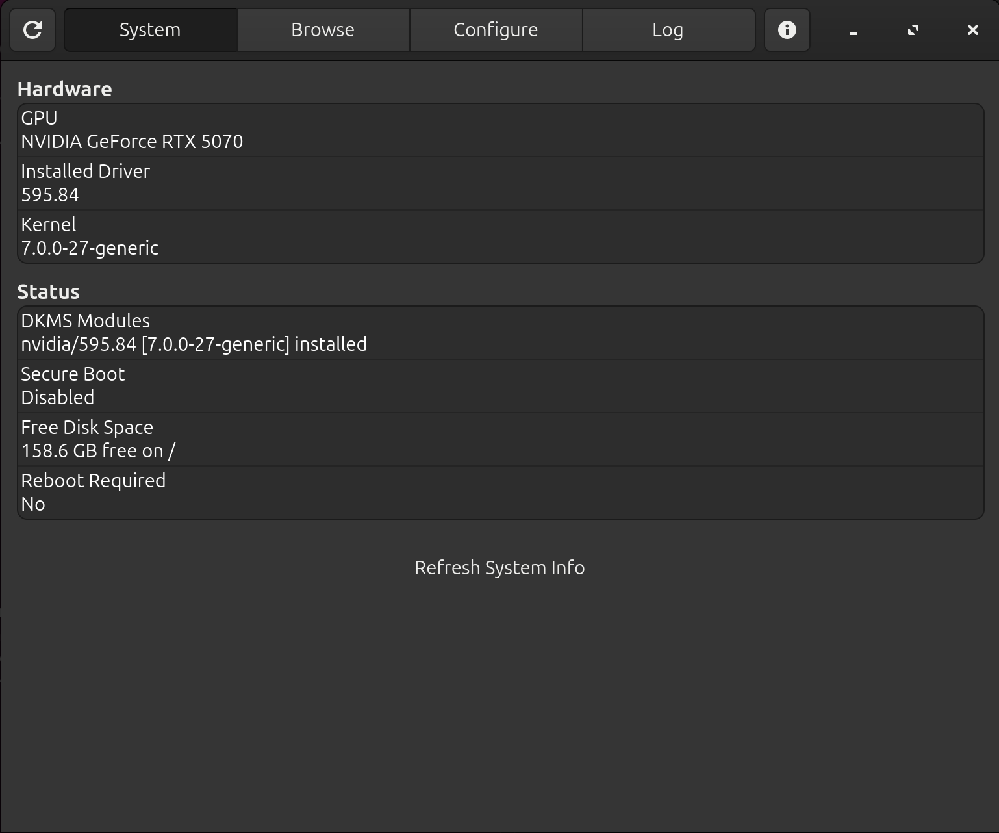
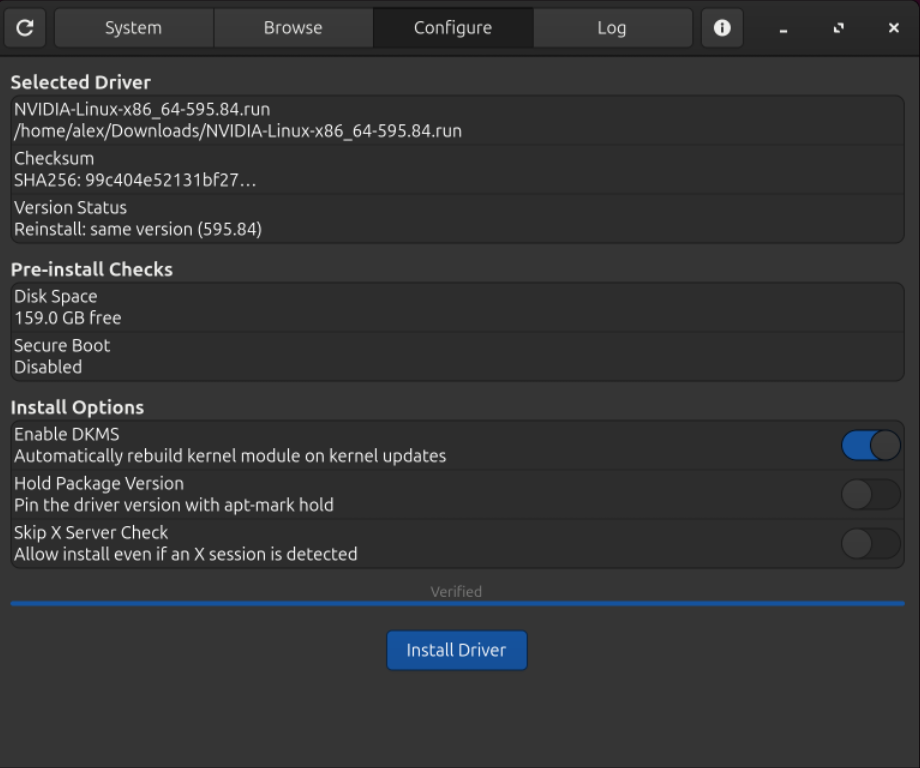
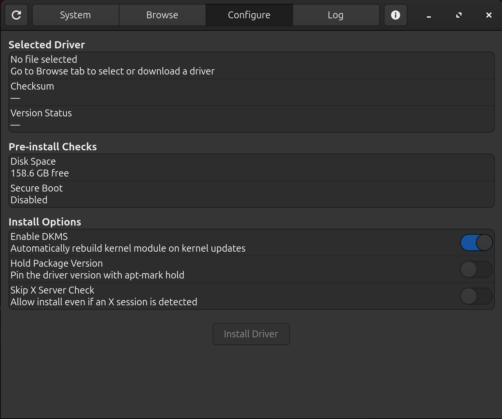
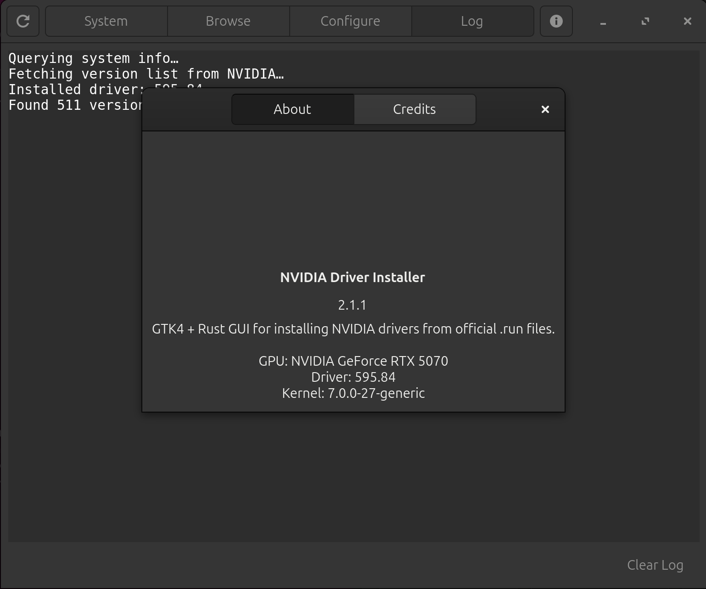

# NVI - NVIDIA Driver Installer

A Linux desktop app for installing NVIDIA drivers from the official `.run` files. Written in Rust with GTK4 and libadwaita.

I run NVIDIA's `.run` drivers instead of the packaged ones because the repos lag behind and I sometimes need a specific version. The usual routine for that is dropping to a TTY, stopping the display manager, running the installer blind, and hoping the desktop comes back. This app skips all of that. It installs the new driver to disk the same way a package manager does, while the current driver keeps running. The swap happens on your next reboot and your desktop never goes down.

## Screenshots

| System | Browse |
|---|---|
|  |  |

| Configure | About |
|---|---|
|  |  |

## What it does

- Lists every driver version on `download.nvidia.com`, newest first, and marks the one you're currently running
- Downloads and verifies against NVIDIA's published SHA256 sums
- Opens local `.run` files too, so Vulkan beta drivers or anything else you downloaded by hand work the same way
- Shows your GPU, running driver, kernel, DKMS status, Secure Boot state, and free disk space in one place
- Knows when a reboot is pending by comparing the kernel module on disk against the one that's loaded
- Registers the driver with DKMS so the module rebuilds itself on kernel updates
- Verifies the `.run` archive before changing anything, so a corrupt download stops the install with your current driver untouched
- The GUI never runs as root. Only the install script does, through polkit, and you can read every line of it in `scripts/privileged-install.sh`

## Requirements

- x86_64 Linux with systemd and polkit
- Either an apt-based distro (Ubuntu, Debian, Mint) or a dnf-based distro (Fedora, RHEL, Nobara). The install script detects which one you have and uses the right package manager. Anything else, the GUI runs fine through the AppImage but the install script will refuse to run.
- Kernel headers and DKMS, which the script installs for you if missing (`linux-headers`/`build-essential` on apt, `kernel-devel`/`kernel-headers` on dnf)

Developed and tested on Ubuntu 26.04, GNOME on Wayland, RTX 5070, 595.x driver branch. Fedora support added in 2.4.0, less battle-tested than the Ubuntu path — if something's off on Fedora, open an issue.

## Install

Download the AppImage from [Releases](../../releases):

```bash
chmod +x nvidia-driver-installer-2.3.0-x86_64.AppImage
./nvidia-driver-installer-2.3.0-x86_64.AppImage
```

The first launch asks for your password once so it can place the install helper at `/usr/lib/nvidia-driver-installer/` and register its polkit policy. After that it starts like any other app. If you later download a newer AppImage, it detects the change and refreshes those files on its own.

## Using it

1. The System tab shows your hardware and current driver state.
2. On the Browse tab, pick a version and hit Download, or use Open .run File if you already have one.
3. On the Configure tab, leave DKMS on, optionally enable the apt hold, and hit Install Driver.
4. Enter your password and wait a few minutes while the kernel module builds. The desktop stays up the whole time.
5. Reboot whenever it suits you. The System tab shows Reboot Required: Yes until you do.

## Headless servers

The GUI is optional. The install script is standalone bash and works the same on apt or dnf systems:

```bash
wget https://download.nvidia.com/XFree86/Linux-x86_64/595.84/NVIDIA-Linux-x86_64-595.84.run
sudo ./privileged-install.sh ./NVIDIA-Linux-x86_64-595.84.run --dkms
```

Flags:

| Flag | Effect |
|---|---|
| `--dkms` | Register the module with DKMS (recommended) |
| `--hold` | Pin the driver at its current version — `apt-mark hold` on apt, `dnf versionlock` on Fedora (needs `python3-dnf-plugin-versionlock` installed) |
| `--no-x-check` | Accepted for compatibility, the installer already skips the X check |

Reboot afterward to switch drivers, same as the GUI flow.

## Logs and troubleshooting

Two files tell you everything:

- `/var/log/nvidia-driver-installer.log` is written by this app's install script, step by step
- `/var/log/nvidia-installer.log` is NVIDIA's own installer log

If an install fails, the reason is in one of those. The most common cause is missing kernel headers for a brand new kernel, which resolves once your distro publishes them.

## Uninstalling

To remove the driver itself:

```bash
sudo nvidia-uninstall
```

To remove this app, delete the AppImage and optionally the helper files it installed:

```bash
sudo rm -rf /usr/lib/nvidia-driver-installer
sudo rm /usr/share/polkit-1/actions/io.github.labj1987.NVI.policy
```

## Building from source

Needs `cargo`, `rustc`, `libgtk-4-dev`, `libadwaita-1-dev`, `pkg-config`, and `libssl-dev`. The build script installs its own dependencies through apt.

```bash
sudo bash build-appimage.sh
```

The output lands in the project directory. `Cargo.lock` is committed, so builds are reproducible.

## How the install actually works

The script runs NVIDIA's installer with `--allow-installation-with-running-driver`, which is the same behavior your package manager relies on: files and the DKMS module go to disk, nothing touches the loaded driver, and the new one takes over at boot. Before that it verifies the archive with `--check`, makes sure headers and DKMS are present, clears any conflicting distro driver packages, blacklists nouveau, and rebuilds the initramfs afterward. Around 120 lines of bash, all readable.

## License

MIT. See [LICENSE](LICENSE).

Linnard Alex Brown Jr.
